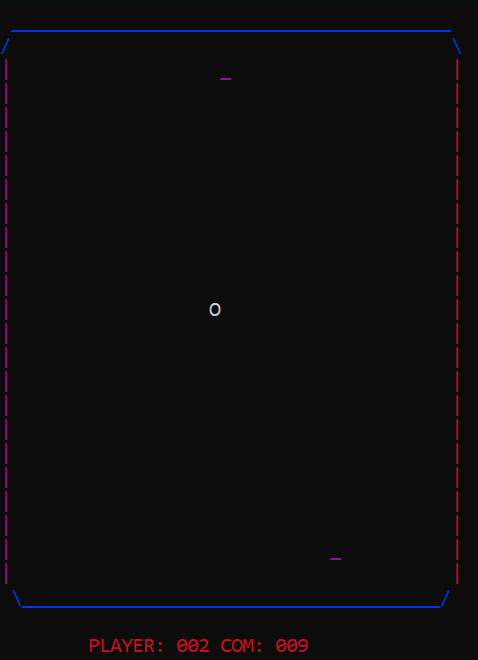
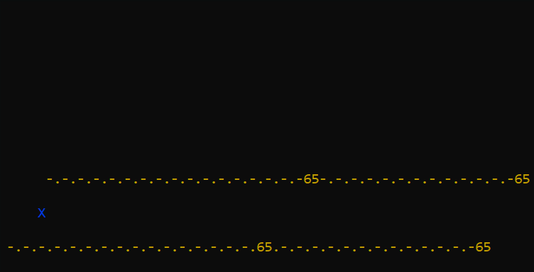

# Cobol-Games

This is the source code for two terminal-based games made in GnuCOBOL.

## Pong

## Dodger

#### Language used

`cobc (GnuCOBOL) 3.1.2.0`

Depends on:
* ncurses (linux)
* `windows.h` and `conio.h` (windows)